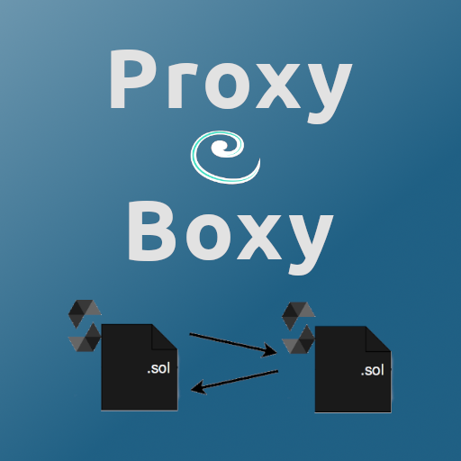

# Proxy Boxy

Learn to create, deploy, and interact with Proxy Contracts

Created with <3 for my talk **Proxy 101 Save Gas and prevent Headaches** at **Trufflecon in Redmond, Washington
Aug 2-4 2019**

View the presentation [here](https://docs.google.com/presentation/d/1XiFpea4iC9lYA9MGQRwWfk2JzvK9Xn_EGXy_zdR5nJE/edit?usp=sharing)



## 0. What is a Proxy

This tutorial is adapted from [EIP 1822](https://github.com/ethereum/EIPs/blob/master/EIPS/eip-1822.md) Universal Upgradeable Proxy Standard (UUPS)

## 1. (optional) Use Remix to play with the contracts

[Remix Example](https://remix-alpha.ethereum.org/#gist=6da9368618132420d958dfbba5db54eb)

## 2. Closer look at the contracts

This is the Proxy Contract

```js
pragma solidity ^0.5.1;

contract Proxy {
    // Code position in storage is keccak256("PROXIABLE") = "0xc5f16f0fcc639fa48a6947836d9850f504798523bf8c9a3a87d5876cf622bcf7"
    constructor(bytes memory constructData, address contractLogic) public {
        // save the code address
        assembly { // solium-disable-line
            sstore(0xc5f16f0fcc639fa48a6947836d9850f504798523bf8c9a3a87d5876cf622bcf7, contractLogic)
        }
        (bool success, bytes memory _ ) = contractLogic.delegatecall(constructData); // solium-disable-line
        require(success, "Construction failed");
    }

    function() external payable {
        assembly { // solium-disable-line
            let contractLogic := sload(0xc5f16f0fcc639fa48a6947836d9850f504798523bf8c9a3a87d5876cf622bcf7)
            calldatacopy(0x0, 0x0, calldatasize)
            let success := delegatecall(sub(gas, 10000), contractLogic, 0x0, calldatasize, 0, 0)
            let retSz := returndatasize
            returndatacopy(0, 0, retSz)
            switch success
            case 0 {
                revert(0, retSz)
            }
            default {
                return(0, retSz)
            }
        }
    }
}
```

This is the part which is added to your contract. It enables upgradability

```js
pragma solidity ^0.5.1;

contract Proxiable {
    // Code position in storage is keccak256("PROXIABLE") = "0xc5f16f0fcc639fa48a6947836d9850f504798523bf8c9a3a87d5876cf622bcf7"

    function updateCodeAddress(address newAddress) internal {
        require(
            bytes32(0xc5f16f0fcc639fa48a6947836d9850f504798523bf8c9a3a87d5876cf622bcf7) == Proxiable(newAddress).proxiableUUID(),
            "Not compatible"
        );
        assembly { // solium-disable-line
            sstore(0xc5f16f0fcc639fa48a6947836d9850f504798523bf8c9a3a87d5876cf622bcf7, newAddress)
        }
    }
    function proxiableUUID() public pure returns (bytes32) {
        return 0xc5f16f0fcc639fa48a6947836d9850f504798523bf8c9a3a87d5876cf622bcf7;
    }
}
```

## 3. Use Truffle and OneClickDapp to go through the example again

Download the "Proxy Boxy" Truffle Box

`truffle unbox https://github.com/pi0neerpat/proxy_101`

Set up your environment using `truffle develop`

Copy the private key for the first wallet. Open Metamask and create a new wallet using the key.

Then create + switch to the "Truffle Develop" network at `http://127.0.0.1:9545/`

Back in the console run `migrate`

You will see an output like this

```
Access ShipA via the Proxy at:

    https://oneclickdapp.com/motel-disco
```

Open the first link and inspect your ship using `fuelSupply` and `captain`

when you're ready to upgrade follow the prompt

```
When you're ready to upgrade call the function abandonShipTo()
on ShipA using the address for the ShipB logic contract

0xb2FC7d4271cA7c96Fb9F4585a1C0871f01107991

Access ShipB via the Proxy at:

     https://oneclickdapp.com/lady-escort
```
